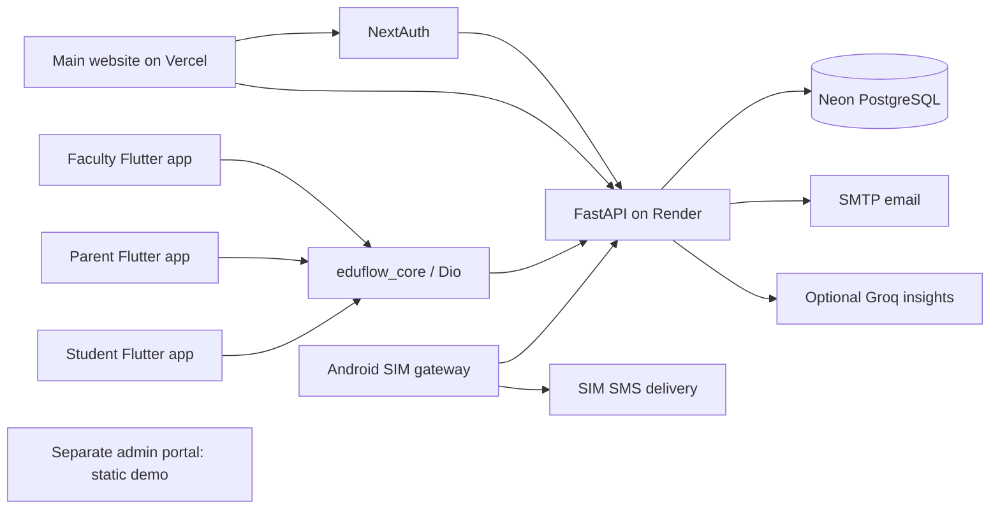

# EduFlow codebase analysis

Reviewed September 10, 2026, at local commit `0e45a9a`.

The repository is a multi-application academic management platform. It contains substantial attendance, administration, timetable, reporting, and parent-dashboard implementations, alongside unfinished ERP features. A deployed website or an existing APK does not establish that every displayed feature works.

## Scope and evidence

Reviewed application structure, route registrations, authentication, models, attendance writes, reports, notifications, client API calls, mobile navigation, build configuration, and available tests. The application source directories contain approximately 17,921 lines across 164 Python, TypeScript, CSS, Dart, and Kotlin files. There are 92 backend route decorators and 98 registrations after the device-router alias is counted.

The local Git remote matches the GitHub repository supplied by the owner. GitHub's public web fetch did not succeed, so this analysis does not assert that remote HEAD or either deployed build matches the local commit. Render and Vercel hosting are owner-confirmed; the Render URL also appears throughout client configuration. No Vercel project settings or deployment logs were inspected.

Validation included TypeScript checks, Dart analysis, parsing 85 backend Python files, running the existing ERP verification against in-memory SQLite, and inspecting Neon schema names and aggregate counts in a read-only transaction. This was not a complete runtime test of every screen, an Android build, or an SMS delivery test. Application source and production records were not changed. Analysis artifacts were added under this directory. Existing untracked `backend/apply_neon_parent.py` and `backend/debug_parent.py` were left untouched.

## Application map

| Directory | Technology | Responsibility | Implementation state |
|---|---|---|---|
| `frontend` | Next.js 16.2.9, React 19, TypeScript, NextAuth, Tailwind, Three.js | Main website, animated landing page, login, role dashboards, student/staff management, timetable, reports, SMS controls | Main web application; several API and type errors |
| `admin-portal` | Next.js 16.2.10, React 19, TypeScript | Separate executive dashboard and student-detail demonstration | Static sample data; authentication and backend fetches are not wired |
| `faculty-app` | Flutter, Riverpod, GoRouter | Faculty login, weekly schedule, assigned sections, attendance submission | Real backend calls; main mobile operational client |
| `parent-app` | Flutter, Riverpod, Dio, local notifications | Parent login, child dashboard, timetable, attendance, notification list, term selector, settings | Dashboard and profile fetches exist; several secondary screens are demonstrations |
| `student-app` | Flutter, Riverpod, GoRouter | Student login and academic dashboard | Login calls backend; dashboard content and actions are largely static |
| `eduflow_core` | Shared Dart package | Authentication storage, Dio client, Hive storage, theme, widgets, notification interface | Shared by all three Flutter apps; biometrics and FCM are placeholders |
| `android-sms-gateway` | Kotlin, Compose, Retrofit, Room, WorkManager | Pair physical phone, send heartbeats, poll SMS queue, send through SIM | Real foreground service exists, but API path and reliability issues block the intended flow |
| `backend` | FastAPI, SQLAlchemy, PostgreSQL | Shared identity, tenant administration, academics, attendance, reporting, notifications | Core operational backend with both legacy routers and newer consumer/engine layers |
| `built-apks` | Android binaries | Previous app outputs | Their correspondence to current source was not established |

The mobile apps call Render directly, independently of Vercel. Their base URL is hardcoded in `eduflow_core/lib/core/network/dio_client.dart`; the gateway has its own hardcoded Retrofit URL. The website repeats a configurable API URL with a Render fallback across many pages.

## Backend and data organization

The database is organized around institutions and users with SUPERADMIN, MANAGEMENT, ADMIN, FACULTY, STUDENT, and PARENT roles. Student profiles belong to sections; sections belong to classes and departments. Profiles do not uniformly have their own tenant column, so tenant enforcement often requires joins.

Two academic structures coexist: the original departments/classes/sections/courses/year models and ERP branches/semesters/subjects/periods/timetable models. `AcademicYear` and `AcademicSession` are separate concepts, but several flows do not consistently connect them.

Attendance records carry student, section, date, optional period, subject, academic session, present/status, and marker information. Five summary levels exist: student, subject, faculty, department, and institution. Supporting models cover parent links, events, exams, marks, leave requests, documents, notifications, devices, and SMS queue items.

The intended engine architecture includes scheduling, attendance, academic calendar, reporting, analytics, identity, workflow, notification, timeline, and file services. Some engines contain real logic; others have `pass` bodies or simulated behavior. Most active attendance writes still live directly inside API handlers rather than passing through the separate attendance-session engine.

See [the complete registered API inventory](api-route-inventory.md) for methods, paths, source locations, and declared dependencies.

## Main operational flows

1. **Institution onboarding:** superadmin provisions institution and management accounts; management creates academic structure and bulk student profiles. Updating a student's parent email can create a parent user/profile/link. The website's `/setup` wizard itself only delays and redirects, and does not submit its collected data.
2. **Authentication:** NextAuth exchanges credentials or Google identity through FastAPI. All three Flutter login screens currently call `/auth/passwordless`. The backend returns a JWT; Flutter saves it in SharedPreferences and Dio attaches it to requests.
3. **Attendance:** the faculty app fetches weekly schedules and students, then posts explicit records to `/attendance/submit`. The website posts absent IDs to `/attendance/submit/smart`; the backend treats other students in that section as present. Both update records, timeline entries, summaries, and absence notifications. Background tasks enqueue SMS messages.
4. **Parent visibility:** `/parent/dashboard` resolves the first linked student and calls `DashboardEngine.get_student_mega_payload`. The parent app refreshes approximately every 60 seconds. The payload combines attendance, timetable, events, results, comments, and notifications. The profile endpoint can list multiple children, but the dashboard does not expose an equivalent child-selection parameter.
5. **SMS:** the website generates a pairing token, Android registers a UUID, and a foreground service polls every 15 seconds. Messages are stored in Room and submitted to SmsManager; status is posted back. The backend implements legacy and enterprise queue behavior under its legacy SMS router.
6. **Reporting and transitions:** materialized summaries feed master-ledger and enterprise analytics endpoints. Term promotion archives a current session, creates another, optionally copies timetable entries, and creates notices. Several queries and timetable writes are not consistently scoped to a session.

## Verified live database snapshot

The read-only connection reported `transaction_read_only = on`. It found 47 public tables and no missing model-declared table or column names. This comparison does not validate data types, indexes, foreign keys, defaults, or uniqueness constraints.

| Entity | Count |
|---|---:|
| Institutions | 2 |
| Users | 9 |
| Student profiles | 64 |
| Faculty profiles | 1 |
| Parent profiles | 4 |
| Parent/student links | 4 |
| Academic sessions | 0 |
| ERP timetable entries | 30 |
| Attendance records | 924 |
| SMS queue entries | 36 |

There are 3 SUPERADMIN users, 1 MANAGEMENT, 1 FACULTY, 1 STUDENT, and 3 PARENT users. These are counts, not a claim that every account is correctly provisioned. The absence of academic-session records means the term-oriented code is currently relying on its no-session behavior. No personal records or credentials are included in the saved [schema summary](database-schema-summary.json).

## Highest-priority findings

### Identity verification is bypassed

`backend/app/api/auth.py:101` issues a real token for a supplied email, mobile number, or roll number without password, OTP, or ownership verification. Matching privileged users are eligible, and selection favors the most privileged matching role. This affects both website and mobile clients. It must be treated as authentication bypass, not a secure passwordless implementation.

`backend/app/api/consumers/parent.py:41` accepts a fixed OTP and looks up a user by mobile without requiring a parent role. Its new-user branch omits the required `hashed_password`. The student-link endpoint reports success without creating a link or verifying the supplied institution and date of birth.

JWTs default to ten years, mobile token refresh is unimplemented, and SharedPreferences holds bearer tokens. The shared biometric method simply returns true. Known fallback secrets and placeholder account passwords exist in source. Google login uses a server-shared secret, so both server environments must agree on it; their fallback values differ.

### Tenant and ownership checks are inconsistent

`backend/app/api/consumers/management.py:70` permits any active user to request a student dashboard. `backend/app/engines/dashboard_engine.py:17` fetches the student by ID and then overwrites the supplied tenant with the student's section tenant. Together these remove the intended tenant boundary.

`backend/app/engines/enterprise_analytics_engine.py:31` starts the master sheet from all student profiles, without tenant filtering. Its promotion flow also selects all students when no section is specified. `materialized_summary_engine.py:274` counts students globally for an institution summary.

Both attendance submission handlers require a faculty role but do not establish that the submitted section and students belong to the faculty's tenant and authorized assignment. Period lookup selects the first matching period number without tenant scoping. Parent leave/document endpoints do not verify the requesting parent's link to the requested child. The smart-build mutation endpoint has no user-authentication dependency.

These findings are based on source tracing, not attacks against the deployed service.

### Client and server paths have drifted

| Caller path | Current backend path |
|---|---|
| `/api/v1/sms/pending`, `/sms/status`, `/sms/stats` | `/api/v1/legacy-sms/pending`, `/legacy-sms/status`, `/legacy-sms/stats` |
| `/api/v1/notification/logs` | `/api/v1/legacy-notifications/logs` |
| `/api/v1/institution/me/settings` | `/api/v1/institutions/me/settings` |
| `/api/v1/institution/reports/detailed` | `/api/v1/institutions/reports/detailed` |
| `/api/v1/consumers/management/leaves` | `/api/v1/management/leaves` |

The newer `/sms` router only exposes its root status response. Therefore the gateway's pending/status calls have no matching route in the local backend. The mismatches also affect website SMS statistics, settings, reports, and leave approvals. The middleware omits PARENT from its role map, despite a parent web page, and MANAGEMENT is not allowed into `/dashboard/leave-approvals`. Faculty can navigate to the master sheet but its API requires management access.

### Runtime and data-correctness defects

- Parent profile serialization accesses `relationship_to_student`, which is not declared on ParentProfile. Faculty contact serialization accesses `User.full_name`, which is not declared on User.
- Mark submission stores the requested SGPA directly, while dashboard rendering divides it by 100, creating inconsistent units.
- Website class deletion references an undefined `handleDeleteClass`.
- Attendance records and summaries lack declared composite uniqueness for their logical identity. Query-then-insert writes can race. Regular submission does not constrain `period IS NULL` for daily attendance and can update a period record instead.
- Regular attendance submissions queue SMS again for every submitted absence; the smart path only queues new absence transitions. Their behavior differs, and the regular path omits the period argument when queueing SMS.
- Faculty completion summaries count distinct attendance session IDs, but the main submission handlers do not assign those session IDs. Completion metrics therefore do not measure submitted periods reliably.
- Reports join subjects, so attendance with no resolved subject can be excluded. Selected-term filtering is inconsistent across dashboard attendance, marks, and enterprise analytics.
- Timetable saving deletes all existing section timetable rows without an academic-session filter and writes replacements without a session ID. This conflicts with historical timetable preservation.
- Attendance commits before summary processing, which then commits separately and can silently swallow a commit error. Summary work also rescans student history synchronously despite comments describing nonblocking updates.

### SMS and notification reliability

The gateway supplies a bearer token, but queue/status and heartbeat handlers identify devices through UUID without validating that token. The foreground service marks a message SENT immediately after handing it to SmsManager, with no sent/delivery callback. Failed backend status sync has no implemented reconciliation worker. Multiple service starts can launch multiple polling loops.

Enterprise queue recovery resets claims after 60 seconds while the phone may take roughly 100 seconds to send a 50-message batch. The client does not implement the enterprise ACK flow; after route repair, this requires reconciliation to prevent repeat sends. Legacy claiming is not protected by the enterprise row-locking mechanism.

The separate NotificationEngine simulates successful FCM and adds notification logs rather than actual SmsQueue items. The shared mobile notification service returns a mock token. A locally initialized notification helper and an in-app notification list do not constitute working push delivery. Actual background SMS creation currently comes from `services/sms.py`.

## Incomplete feature inventory

| Feature | Evidence of incompleteness |
|---|---|
| Separate admin portal | Hardcoded metrics, student payload, and assistant conversation |
| Student mobile dashboard | Hardcoded identity, attendance, countdown, assignments; empty action callbacks |
| Parent leave requests | Simulated delay and success message; no API write |
| Parent documents/contact/payment | Static items and placeholder button behavior |
| Website document upload | Sends an example URL rather than uploading a file |
| Website setup wizard | Redirects without saving |
| Push and biometric authentication | Shared implementations are mocks |
| Workflow/file/parts of academic engines | Empty method bodies |
| Unified reports consumer | Returns empty data |
| AI features | Mix of rule-based messages, fixed trends, and optional Groq-backed student insight |

## Validation results and deployment considerations

| Check | Result |
|---|---|
| Python syntax parsing | 85 files parsed successfully |
| Main website TypeScript | Failed: invalid NextConfig `eslint` field, undefined class-delete handler, two timetable indexing errors |
| Admin portal TypeScript | Passed |
| Existing backend ERP verification | First two stages pass; stage 3 fails with `KeyError: warning_badge`; stages 4 and 5 are not reached |
| Faculty Dart analysis | Fails on stale `MyApp` widget test; also reports warnings/deprecations |
| Parent Dart analysis | Fails on stale `MyApp` widget test; also reports warnings/deprecations |
| Student Dart analysis | Fails on stale `MyApp` widget test; also reports warnings/deprecations |
| Shared package standalone analysis | Inconclusive: its standalone package dependencies are unresolved in this checkout |
| Neon inspection | Successful, enforced read-only; model table/column names present |

The main website sets `typescript.ignoreBuildErrors = true`, which allows type defects to survive the intended build gate. No GitHub Actions workflow, Render manifest, or Vercel manifest was found in the tracked configuration inspected. Root documentation is absent and app READMEs are mostly starter material.

Backend startup calls `create_all` and executes many ALTER statements, swallowing failures. This makes startup responsible for schema changes and obscures partial migrations. Alembic is a dependency, but a versioned migration setup was not found. Most Python dependencies are unpinned.

Docker Compose includes Redis and a Celery worker, but the declared Celery module is absent and Celery is not in requirements. The active SMS flow uses FastAPI BackgroundTasks instead. Compose also starts the API with development reload. These files should not be assumed to reproduce the owner-managed Render deployment.

## Suggested order for subsequent implementation

1. Replace unverified login and enforce tenant, role, child-link, and faculty-assignment checks server-side.
2. Reconcile route contracts across the website, Flutter apps, and SMS gateway; add focused API contract tests.
3. Fix the verified TypeScript, parent serialization, and test-suite failures; restore meaningful build gates.
4. Establish academic-session invariants, tenant-scoped reports, consistent GPA units, and attendance uniqueness/idempotency.
5. Make queue claims, ACKs, device authentication, delivery callbacks, and retry reconciliation consistent.
6. Wire the parent secondary screens and student dashboard to real APIs, with explicit empty/error states.
7. Replace startup DDL with reviewed migrations, document deployment settings, and introduce isolated integration checks.

This sequence addresses correctness and access control before expanding the currently demonstrated features.
