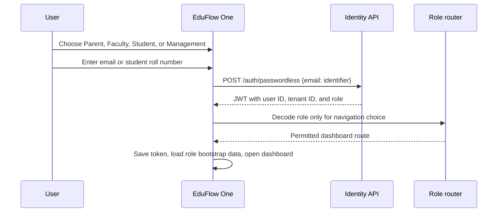

# EduFlow One — unified Flutter product plan

## Product decision

Replace the separate `faculty-app`, `parent-app`, and `student-app` projects with **EduFlow One**, one Flutter application with a single signed-in identity, a role-aware shell, shared primitives, and role-specific workspaces. Management is included in the same application; its desktop/tablet layout exposes the full control room, while mobile offers decision approvals, alerts, and drill-downs.

This does not mean every role receives the same dashboard. It means there is one release train, one account system, one design language, one notification layer, one offline sync layer, and one source of truth for a person who has more than one relationship with an institution.

The existing apps should remain available until EduFlow One reaches feature parity. Do not merge code by copying screens. Extract stable shared primitives and rebuild the flows against one set of contracts.

## The experience to build

The visual direction is **Campus Prism**: deep ink surfaces, subtle glass depth, luminous violet-to-mint accents, purposeful motion, tactile cards, and dense but calm information. It should feel premium without becoming a decorative dashboard.

Three rules keep the UI useful:

1. Every screen answers “what changed, why does it matter, and what can I do now?”
2. Animation communicates a state change, hierarchy, or progress. It never delays an urgent action, spins forever, or makes data harder to read.
3. The app adapts to role, device size, connectivity, accessibility settings, and language. It does not merely recolor the same page.

The login concept is shown in the companion interaction mockup. The role selector adapts the entry method and the visual narrative, but never grants a role. The verified backend account makes that decision.

## Account and login model — current release

Do not change the current login method during the unified-app build. EduFlow One reuses the identifiers and backend calls already familiar to users, then routes by the role inside the returned token.

| Audience | Entry field now | Current API behavior to preserve | Default destination |
|---|---|---|---|
| Parent | Email | Submit the registered parent email to `/auth/passwordless` | Family Pulse |
| Faculty | Email | Submit the authorised faculty email to `/auth/passwordless` | Teaching Flight Deck |
| Student | Roll number, for example `24AG1A05L6` | Submit roll number as the existing `email` field to `/auth/passwordless`; backend resolves or creates the student user | My Momentum |
| Management/Admin | Email | Use the existing email login and route only when returned role is MANAGEMENT, ADMIN, or SUPERADMIN | Campus Control Room |

### Exact current-login sequence



### Current session behavior

- Keep the existing token response and token storage behavior until login refactoring becomes a separately approved project.
- The selected role in the login UI is a shortcut that changes the field label, example, and requested destination. The returned JWT role is the final routing authority.
- If a Parent email produces a PARENT token, open Family Pulse. If the token role does not match the selected audience, show a clear message and route to the account’s allowed dashboard instead.
- Student roll-number login remains case-insensitive and must display an exact example such as `24AG1A05L6`.
- Management mobile access is new UI work, not a new authentication method.

### Later authentication hardening

The current passwordless endpoint remains a known security risk and must be replaced later by an approved secure-login project. It is explicitly outside this UI and wiring phase, so the user journey remains unchanged now.

## One Flutter architecture

Create a new `eduflow_one` application. Promote `eduflow_core` into well-defined packages rather than a miscellaneous shared folder.

```text
packages/
  eduflow_design/        tokens, themes, motion, icons, accessibility primitives
  eduflow_auth/          session, role switcher, secure storage, sign-in flows
  eduflow_api/           typed API client, interceptors, errors, refresh handling
  eduflow_sync/          offline command queue, conflict states, connectivity
  eduflow_domain/        roles, policy, entity models, use cases
  eduflow_features/      reusable feature modules
apps/
  eduflow_one/           application composition, routes, platform integration
```

Use Riverpod for state, GoRouter for guarded navigation, Dio for typed HTTP, Drift or a structured Hive schema for offline cache, `flutter_secure_storage` for secrets, and Firebase Cloud Messaging only after server-side device registration is real. A feature exposes repository interfaces and view models; UI never calls a raw endpoint from a widget.

### Navigation model

The app uses one `AppShell` with an adaptive navigation rail on tablet/desktop and a thumb-reachable bottom bar on phones. Roles receive different tabs and different command surfaces.

| Role | Primary navigation | Immediate action |
|---|---|---|
| Student | Today, Learn, Progress, Inbox, Me | Ask for help / complete recovery step |
| Faculty | Today, Classes, Learners, Insights, Me | Mark attendance / start a class pulse |
| Parent | Family, Progress, Actions, Inbox, Me | Respond to a request / view child plan |
| Management | Command, Operations, People, Insights, More | Approve, simulate, publish, assign owner |

Role switch, notification center, global search, and the selected institution/child appear in the shell. A command palette on tablet/web gives management and faculty fast actions without hiding essential flows behind a menu.

## Live-data wiring contract

No dashboard is complete until every visible number has a live source, loading state, error state, timestamp, and refresh behavior. The unified Flutter UI must use typed repositories and view models; widgets must never contain direct `dio.get` or `dio.post` calls.

| Workspace | Bootstrap request | Live requests and commands | Backend work required |
|---|---|---|---|
| Student | `GET /student/me/dashboard` | timetable, subject attendance, results, notices, recovery actions, correction/help requests | Build this endpoint. The current student consumer only returns a placeholder and the Flutter dashboard is static. Scope every record to the token's student profile. |
| Faculty | `GET /faculty/me/dashboard` | weekly schedule, class roster, attendance status/report, submit attendance, learner pulse, handover | Consolidate current academic and attendance endpoints into a faculty-safe bootstrap. Verify section assignment server-side for every roster and attendance command. |
| Parent | `GET /parent/dashboard` | profile, linked children, selected-child dashboard, leave request, documents, faculty contacts, notifications | Preserve the existing parent dashboard but add an authorised `child_link_id` selector. Wire currently static leave, document, contact, and fee views to real endpoints. |
| Management | `GET /management/me/dashboard` | attendance overview, events, leave approvals, staff, academic structure, timetable, SMS health, reports, analytics | Build this mobile bootstrap now. It composes existing tenant-scoped services and returns only management-authorised data. |

### Management mobile dashboard — build now

The existing system has management web pages but no dedicated Flutter dashboard. EduFlow One must add this in the first mobile release.

1. **Command tab:** decisions requiring attention: leave approvals, unmarked attendance, gateway failures, timetable clashes, and data-quality issues.
2. **Operations tab:** live attendance overview, active classes, faculty availability, and SMS delivery health. A tap opens the evidence, affected people, and a proposed action.
3. **People tab:** staff, sections, and student groups with role-appropriate actions. Avoid a full desktop table on phones; use search, filters, and drill-down sheets.
4. **Insights tab:** tenant-scoped trends, shortage groups, and attendance risk explanations. Every insight links to its source records and applicable policy.
5. **More tab:** institution setup, reports, timetable editing, and audit history. On tablet/desktop, this becomes the full Control Room with a navigation rail and wide data layouts.

The management dashboard must refresh with pull-to-refresh and foreground resume. Live operational cards can poll at a restrained interval while the app is open; all writes use an optimistic state only after server acknowledgement.

### Student mobile dashboard — build now

The current student Flutter app logs in but shows hardcoded content. Replace it with a live dashboard as part of the same release:

1. After successful roll-number login, call `GET /student/me/dashboard` using the returned bearer token.
2. Render the authenticated student's name, roll number, current/next timetable item, per-subject attendance, overall attendance, notices, marks, and support/recovery items.
3. Show independent skeleton, empty, error, stale-cache, and retry states for each section; one broken card must not blank the whole dashboard.
4. Use the server as the authority. Flutter never accepts a student ID from route parameters to fetch another student's data.
5. Add `GET /student/me/timetable`, `GET /student/me/attendance`, `GET /student/me/results`, and `GET /student/me/notifications` as smaller refreshable endpoints after the bootstrap endpoint is stable.

### Real-time and offline behavior

- Parent and student dashboards cache the last successful payload with a visible “Updated at” label and refresh when the app returns to foreground.
- Faculty attendance is the only required offline-first write in phase one. Store it locally with a stable request ID; retry automatically; show the accepted/review-needed state returned by the server.
- Management approval actions stay online-only in the first release. This prevents accidental approvals after a stale offline state.
- Push notifications deep-link into the exact authorised incident, action, child, class, or message. A notification is never treated as proof that its data is current; the destination refetches it.

## Role-specific dashboard blueprints

### Student — My Momentum

The student should never begin with a generic attendance percentage.

- **Now card:** current/next class, location, preparation prompt, and one clear action.
- **Momentum strip:** attendance safety per subject, upcoming assessment load, recovery tasks, and a clear explanation of what changes the number.
- **Learning path:** missed-class recovery, concept checkpoints, faculty-shared material, and progress evidence.
- **Future view:** “what happens if I miss/attend the next class?” planner with source timetable and policy assumptions.
- **Inbox:** messages requiring acknowledgement and support plans with named owners.

Student actions create traceable requests: attendance correction, help request, leave request, document request, or feedback. They never directly alter academic records.

### Faculty — Teaching Flight Deck

Faculty starts from the time-sensitive work, not from a menu of reports.

- **Live class panel:** current class, room, timetable confidence, attendance state, offline state, and an accelerated attendance action.
- **Class pulse:** private, aggregated “understood / need an example / need help” signal and a faculty-approved exit question.
- **Learner radar:** students needing recovery or follow-up, with evidence and recommended next action; no opaque AI risk labels.
- **Teaching continuity:** topic completed, resources used, open questions, next lesson, and replacement/leave handover.
- **Workload timeline:** upcoming classes, pending attendance, assessment conflicts, and approved substitute changes.

Attendance works offline: the faculty sees **Saved locally**, **Syncing**, **Accepted**, or **Needs review**. A successful-looking tap never masks a sync failure. Server idempotency keys stop duplicate submissions.

### Parent — Family Pulse

Parents see the child’s story and useful decisions, not raw institutional data.

- **Child switcher:** prominent, accessible, supports multiple linked children.
- **Today:** class status, meaningful absence/cancellation details, next event, and items needing a parent response.
- **Progress story:** attendance and results with “show me why,” trend context, recovery plan, and respectful explanations in the preferred language.
- **Action inbox:** consent, meeting slots, leave approvals, document requests, and support-plan tasks.
- **Support circle:** a bounded view of faculty/mentor contacts and open action owners, subject to institution policy.

Notifications are grouped by incident, prioritised by action, and can be received in the family’s approved language. Parent access is restricted to linked children and the fields a policy explicitly permits.

### Management — Campus Control Room

Management requires a decision interface, not a larger parent dashboard.

- **Decision queue:** items needing approval, each with impact, owner, deadline, and reversible action.
- **Operational map:** cancellations, absent faculty, room constraints, messaging failures, and timeline changes. Each item links to affected people and proposed resolution.
- **Scenario studio:** simulate timetable changes, capacity changes, academic-calendar changes, and workload pressure before approval. Show constraints and assumptions.
- **Resolution board:** every attendance/engagement/support flag is assigned to an owner and closed with a documented outcome.
- **Institution signal:** tenant-scoped trends, data quality problems, coverage gaps, and unresolved operational work.

Mobile management shows decision approval and urgent operations. Tablet/desktop is the primary canvas for scenario planning, setup, audit work, and large data tables.

## Shared advanced systems

### Campus event ledger

Every important event produces a durable, typed entry: attendance submitted, attendance amended, timetable changed, notification delivered, leave approved, recovery completed, policy changed. The ledger supports timeline views, audit history, idempotency, and reliable notification generation. It replaces scattered side effects inside route handlers.

### Action orchestration

An alert is not done when it has been sent. It becomes a case with an owner, status, due date, allowed audience, and outcome. For example, repeated absences can create a support case, route it to a mentor, offer a faculty recovery action, and show the parent only the approved plan.

### Explainable insight engine

Every recommendation shows its source facts, policy version, assumptions, confidence, and action. AI may draft a summary or suggest an action; it never silently changes attendance, marks, or a student’s eligibility. Faculty and management approve consequential actions.

### Trust and quality monitor

Continuously detect missing tenant scope, impossible timetable combinations, duplicate attendance, stalled SMS sends, stale cached data, missing links, and incompatible policy changes. Create review tasks with evidence rather than silently “fixing” academic data.

## Backend upgrades required before the unified UI

1. Replace the legacy token endpoints with the challenge-based sign-in protocol above.
2. Enforce tenant, role, faculty-section assignment, and parent-child ownership in every API handler. No client-supplied ID is authorization.
3. Publish a versioned typed API contract, such as OpenAPI-generated Dart models. Resolve current `/sms` vs `/legacy-sms`, `/institution` vs `/institutions`, and `/consumers/management` path drift.
4. Add academic-session invariants. Timetable, attendance, summaries, and reports must all reference the same tenant and session.
5. Use proper migrations instead of startup DDL. Add database uniqueness and indexes for logical attendance identity and queue message idempotency.
6. Add a refresh-token/session store, device registrations, revoked-session checks, audited privileged actions, and rate limits for login/OTP endpoints.
7. Move SMS sending to authenticated device claims plus delivery callbacks and reconciliation. A UUID alone is not a credential.
8. Build tenant-safe dashboard endpoints designed for each workspace, rather than loading a generic mega-payload and filtering in Flutter.

## Design system specification

### Visual language

- **Base:** ink/navy canvas with elevated glass surfaces in dark mode; warm cloud surfaces in light mode. Both meet contrast requirements.
- **Accents:** one institution-controlled primary accent plus semantic colors for action, caution, success, and danger. Do not give every card a different gradient.
- **Depth:** layered surface elevation, blurred ambient lights, small responsive parallax, and constrained 3D shapes on entry screens only. Content views remain still enough for reading.
- **Typography:** one highly legible sans-serif, tabular numerals for data, large calm hierarchy, and no tiny status text.
- **Motion:** 160–280ms transitions, shared-axis navigation, progress motion for genuine updates, and full reduced-motion support.
- **Accessibility:** text scaling, high contrast, screen-reader labels, focus states, haptics paired with visible confirmation, left/right reachability, and no color-only meaning.

### Component inventory

Build once and reuse: PrismAppShell, role switcher, child switcher, action card, source-explainer sheet, incident thread, offline sync chip, status timeline, campus command bar, empty/error/retry state, confirmation sheet, data-quality warning, and expandable data table. A component is only shared if the task is shared; role dashboards remain distinct compositions.

## Delivery sequence

| Phase | Outcome | Exit criteria |
|---|---|---|
| 0. Foundation | Security and contract repair | Verified auth, tenant-safe authorization, migrations, API contract tests, session handling |
| 1. Design system | Campus Prism design language | Tokens, themes, primitives, motion/accessibility standards, visual regression baselines |
| 2. Unified entry | EduFlow One login and shell | Existing Parent email, Faculty email, Student roll-number, and Management email paths work unchanged; role routing, deep links, notifications |
| 3. Live dashboards | Replace static Flutter views | Build Student My Momentum and Management Command mobile dashboards against typed, real endpoints; retain live Parent and Faculty flows |
| 4. Faculty core | Reliable daily operations | Schedule, offline attendance, retry/review, class pulse, attendance evidence |
| 5. Parent core | Clear family progress | Child switcher, progress story, explainability, recovery actions, and wire static leave/document/contact views |
| 6. Management depth | Decision and resolution system | Command queue, incident ownership, operations map, approval audit trail, tablet Control Room |
| 7. Intelligence | Scenario and support intelligence | Policy-aware planner, scenario studio, explainable recommendations, quality monitor |
| 8. Migration | Safe replacement of legacy apps | Feature parity, telemetry, staged cohorts, rollback support, legacy retirement |

## Quality gates

- A user cannot reach a route or retrieve data outside their tenant, role, faculty assignment, or parent-child link.
- Login is rate-limited, challenge-based, revocable, and tested for account enumeration and role escalation.
- Every academic record edit has an actor, reason, previous value, resulting value, session, and timestamp.
- Every dashboard state has loading, empty, offline, stale, error, and recovery behavior.
- Offline attendance sync is idempotent and tested against duplicate sends, conflict, app restart, and lost connectivity.
- All screens are usable at 320px, tablet, and desktop; text scale and reduced motion are tested.
- The unified app is tested with role-specific golden tests, contract tests, integration tests, and production telemetry that does not expose student content.

## What not to do

Do not merge the three existing apps into one codebase before authentication and backend authorization are corrected. Do not treat a role selector as an authorization control. Do not use generic “AI insights” that cannot show evidence. Do not make the management experience an inflated chart wall. Do not use 3D or glass effects in attendance, emergency, or accessibility-critical flows where they reduce legibility.

The first implementation should be **EduFlow One login + role shell + live Student My Momentum + live Management Command dashboard**. It removes the two biggest current Flutter gaps immediately: the static student dashboard and the missing management mobile dashboard. Faculty attendance reliability follows in the next delivery slice; parent static screens are then wired onto the same typed contracts.
